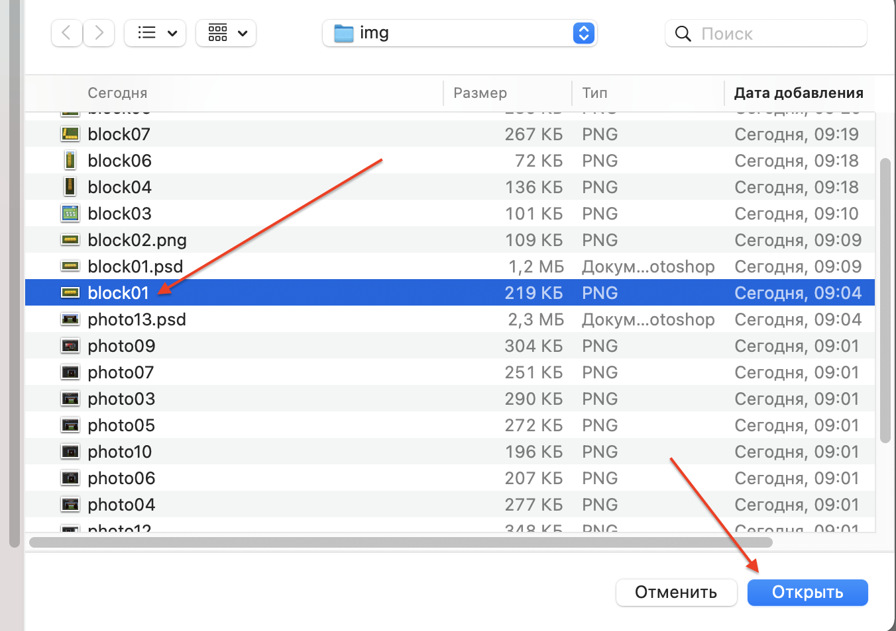

# Власнi проєкти. Підготовка

#### Опис


Сьогодні ми з вами будемо вчитися робити не просто заготовлені завдання, а створювати й реалізовувати власний проєкт🧐


## Згадаймо🤔

1. Що таке координати?
2. Яки бувають координати?
3. Що вам найбільше запам'яталося з усіх занять?

## Сьогодні ми:

1. Пригадаємо, як створювати блоки за координатами
2. Навчимося оцінювати розміри об'єктів на зображенні


Сьогоднішнє заняття дещо відрізняється від попередніх, тому що ми вчитимемось робити не просто заготовленні заняття, а будемо **створювати й реалізовувати власний проєкт**. Іншими словами, будемо **створювати самі для себе завдання**.&#x20;

У результаті у вас має бути побудована **давня будівля** (можете обрати із запропонованих варіантів або знайти свій).

При підготовці проєкту ви можете частину задачі будувати вручну, а далі описувати те, що ви побудували, і створювати відповідні програми.

На цьому занятті ми пригадаємо, **як створювати блоки за координатами** й навчимося оцінювати **розміри об'єктів на зображенні** (як на скриншотах від Майнкрафту, так і на реальних зображеннях).


Візьмемо простий скриншот з Майнкрафту:

<figure><figcaption></figcaption></figure>

За допомогою сервісу [Photopea](https://www.photopea.com/) позначимо потенційні відносні координати, щоб їх можна було створити в код білдері.

<figure><figcaption></figcaption></figure>

Як ми бачимо, наші блоки «тягнуться» від координати 1 до координати&#x20;

.png>)

### Завдання 1

|  №  | Текст завдання                                    | Зображення завдання                   |
| :-: | ------------------------------------------------- | ------------------------------------- |
|  1  | Які координати будуть у такого розміщення блоків? | .png>) |
|  2  | Які координати будуть у такого розміщення блоків? | .png>)  |
|     |                                                   |                                       |

### Завдання 2

Запишіть коди для створення наступних блоків:

.png>)

\

## Розрахунок координат

Для того, щоб позначити цифрами майбутні координати **зробимо та збережемо скріншот**

| Опис                                                                                                                                                        | Скрiн                                |   |
| ----------------------------------------------------------------------------------------------------------------------------------------------------------- | ------------------------------------ | - |
| Відкриємо онлайн редактор для роботи із зображеннями [PhotoPea](https://www.photopea.com/) і в меню «Файл» оберемо пункт «Відкрити».                        | .png>) |   |
| Оберемо файл створеного скриншоту                                                                                                                           |        |   |
| Оберемо інструмент **T** (текст) й точку, в якій поставимо необхідний символ. Збільшимо колір тексту на червоний (щоб текст було краще видно на зображенні) | .png>) |   |
| Збільшимо розмір тексту                                                                                                                                     | .png>) |   |
| За необхідністю використаємо інструмент переміщення елементу на екрані, щоб змінити положення створеного символу                                            | .png>) |   |
| Повністю позначимо майбутні координати                                                                                                                      | .png>) |   |

### **Для чого потрібне позначення координат?**


Коли ви працюєте із зображеннями та відмічаєте на них координати блоків, вам набагато **легше зрозуміти, як підбирати координати в кодах програми** для створення відповідного елементу.&#x20;

Як тільки ви зможете робити це без використання графічного редактору — необхідність його використання для вирішення цієї задачі відпаде.


## Творче завдання

1. Створіть вручну в Майнкрафті певний набір блоків (для початку — нескладний).
2. Зробіть його скриншот (за допомогою сервісу [monosnap](https://monosnap.com/) або lightshot або інших).
3. Надішліть посилання на скриншот до чату вашої групи та запропонуйте друзям запрограмувати створений вами елемент.
4. Візьміть скриншот когось із ваших одногрупників та запрограмуйте його створення.

## Супертворче завдання.

1. Позначте координати на реальному зображенні ростральної колони.

<figure><figcaption>
Place de la Concorde, Paris
</figcaption></figure>

2\. **** Знайдіть в Інтернеті фотографію давньої будівлі (вона знадобиться для виконання проєкту).\
